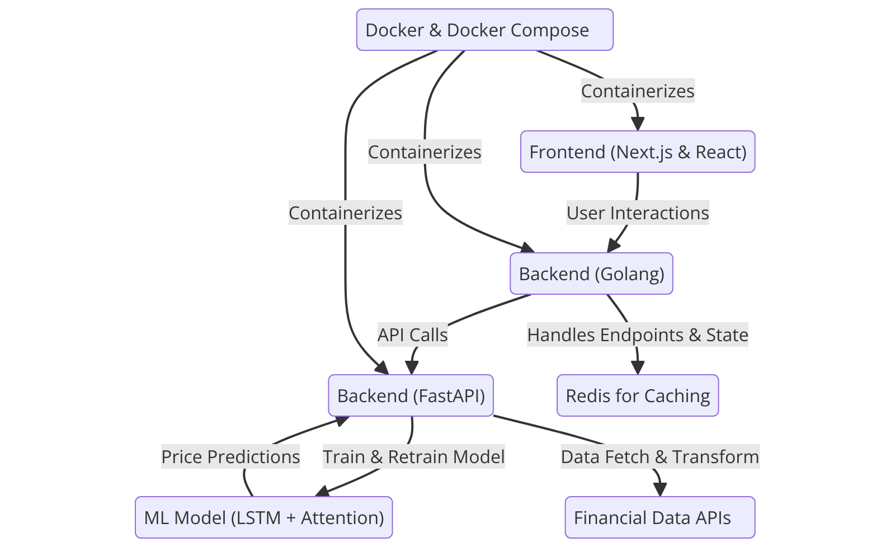
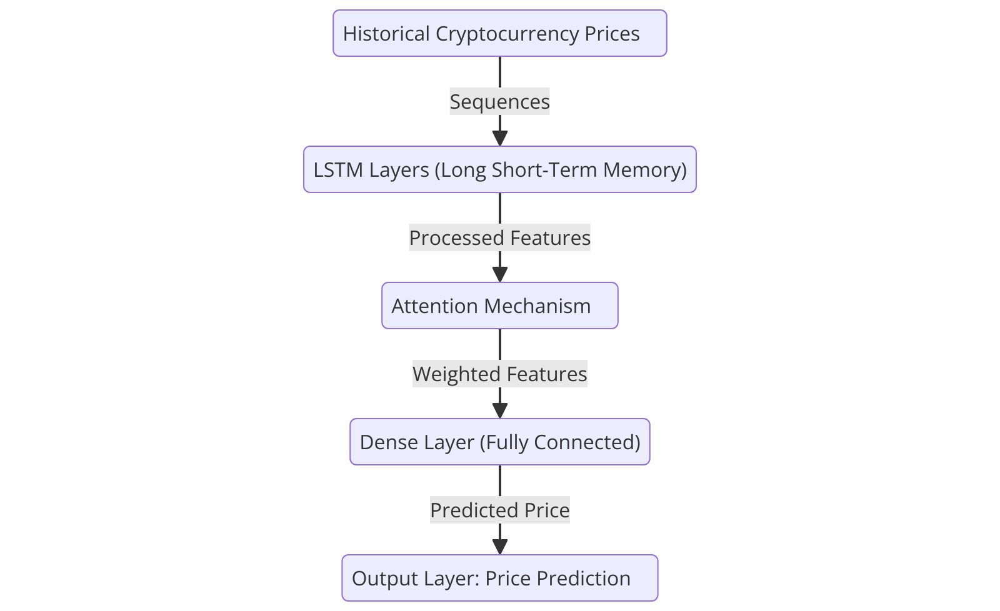

# Visão Geral

Bem-vindo à documentação do projeto de previsão de preços de criptomoedas. Este guia abrange todas as partes do sistema, incluindo os backends em Golang e FastAPI, o modelo de Machine Learning utilizado, o funcionamento do frontend, a configuração do Docker e as instruções para rodar a aplicação. Este documento destina-se a desenvolvedores, colaboradores e interessados que desejam entender ou contribuir para o projeto.

É possível acessar o site "deployado" no seguinte endereço: [Ponderada-Modelo](http://132.226.166.126)

---

# Índice

1. [Arquitetura da Aplicação](#arquitetura-da-aplicação)
   - [Frontend](#frontend)
   - [Backend Golang](#backend-golang)
   - [Backend FastAPI](#backend-fastapi)
2. [Modelo de Machine Learning](#modelo-de-machine-learning)
   - [Por que LSTM com Bloco de Atenção?](#por-que-lstm-com-bloco-de-atenção)
   - [Como o Modelo Funciona](#como-o-modelo-funciona)
   - [Fonte dos Dados](#fonte-dos-dados)
   - [Código do Modelo](#código-do-modelo)
3. [Frontend](#frontend-1)
   - [Componentes Principais](#componentes-principais)
4. [Docker](#docker)
   - [Configuração do Docker](#configuração-do-docker)
   - [Orquestração com Docker Compose](#orquestração-com-docker-compose)
5. [Executando a Aplicação](#executando-a-aplicação)
   - [Pré-requisitos](#pré-requisitos)
   - [Passo a Passo para Rodar](#passo-a-passo-para-rodar)
6. [Estrutura de Diretórios](#estrutura-de-diretórios)
   - [Descrição dos Diretórios Principais](#descrição-dos-diretórios-principais)
7. [Conclusão](#conclusão)
8. [Contato](#contato)

---

# Arquitetura da Aplicação

A aplicação é composta por três principais componentes:

1. **Frontend:** Interface de usuário desenvolvida com Next.js e React.
2. **Backend Golang:** Serviço responsável por gerenciar requisições e comunicação com o modelo de Machine Learning.
3. **Backend FastAPI:** Serviço dedicado ao treinamento e retreinamento do modelo de Machine Learning.



## Frontend

O frontend oferece uma interface amigável para os usuários interagirem com a aplicação. Ele permite a seleção de criptomoedas, configuração de parâmetros para treinamento, visualização de resultados e interação com funcionalidades como retreinamento de modelos já existentes.

## Backend Golang

O backend em Golang atua como intermediário entre o frontend e o serviço de Machine Learning. Suas principais responsabilidades incluem:

- **Gerenciamento de Endpoints:** Fornece endpoints para o frontend interagir, como iniciar treinamentos, retreinamentos e obter previsões.
- **Comunicação com FastAPI:** Interage com o backend FastAPI para operações de treinamento e retreinamento dos modelos.
- **Gerenciamento de Estado:** Mantém o estado das criptomoedas treinadas, armazenando informações sobre quais criptos possuem modelos treinados.

## Backend FastAPI

O backend FastAPI é responsável pelo processamento intensivo de Machine Learning, incluindo:

- **Treinamento e Retreinamento:** Executa o treinamento e retreinamento dos modelos LSTM com bloco de atenção.
- **Gestão de Modelos:** Armazena e gerencia os modelos treinados, garantindo que apenas um número máximo de modelos seja mantido para otimização de recursos.
- **Fornecimento de Previsões:** Gera previsões de preços com base nos modelos treinados e disponibiliza essas informações para o frontend.

---

# Modelo de Machine Learning

## Por que LSTM com Bloco de Atenção?

As redes neurais **LSTM (Long Short-Term Memory)** são altamente eficazes para tarefas de previsão de séries temporais devido à sua capacidade de capturar dependências de longo prazo nos dados. No contexto de previsão de preços de criptomoedas, onde os preços anteriores influenciam significativamente os futuros, o LSTM é uma escolha apropriada.

A incorporação de um **bloco de atenção** aprimora ainda mais o modelo, permitindo que ele foque em partes específicas da sequência de dados que são mais relevantes para a previsão atual. Isso resulta em previsões mais precisas e robustas, já que o modelo pode atribuir diferentes pesos a diferentes trechos de dados históricos.

### Benefícios da Combinação LSTM + Atenção:

- **Captura de Padrões Temporais:** O LSTM lida eficientemente com sequências de dados temporais, aprendendo padrões e tendências ao longo do tempo.
- **Foco em Informações Relevantes:** O bloco de atenção permite que o modelo destaque partes específicas da sequência que são mais informativas para a previsão atual.
- **Melhoria na Precisão:** A combinação resulta em previsões mais precisas e robustas em comparação com modelos que não utilizam atenção.

## Como o Modelo Funciona

O modelo segue os seguintes passos:

1. **Entrada de Dados:** Sequências de preços históricos de uma criptomoeda específica.
2. **Camadas LSTM:** Processamento das sequências para capturar dependências temporais e padrões.
3. **Mecanismo de Atenção:** Avaliação das entradas para determinar quais partes da sequência são mais relevantes para a previsão atual.
4. **Camada de Saída:** Geração da previsão do próximo preço com base nas representações aprendidas.
5. **Treinamento:** Ajuste dos pesos do modelo com base em dados históricos e métricas de erro, como `test_loss` e `test_mae`.

### Diagrama de Funcionamento:



## Fonte dos Dados

Os dados de preços das criptomoedas são obtidos de **APIs públicas de mercado financeiro**, que fornecem informações em tempo real e históricos sobre diversos ativos digitais. Essas APIs garantem a disponibilidade de dados atualizados para alimentar o modelo de Machine Learning, permitindo previsões baseadas nas condições mais recentes do mercado.

### APIs Utilizadas:

- **[Yahoo Finance](https://finance.yahoo.com/):** Utilizado através da biblioteca `yfinance` para obter dados históricos e atuais de preços de criptomoedas.
- **[CoinGecko](https://www.coingecko.com/en/api):** Fornece dados abrangentes sobre preços, volume e capitalização de mercado de diversas criptomoedas.
- **[CryptoCompare](https://min-api.cryptocompare.com/):** Oferece acesso a dados de preços históricos e em tempo real, além de outras métricas relevantes.

Os dados são processados e limpos antes de serem utilizados para treinar o modelo, garantindo a qualidade e a relevância das informações utilizadas nas previsões.

## Código do Modelo

Abaixo está o código do modelo de Machine Learning utilizado, implementado em Python com TensorFlow e Keras:

```python
import yfinance as yf
import pandas as pd
import numpy as np
import json
from sklearn.preprocessing import MinMaxScaler
import tensorflow as tf
from tensorflow.keras import layers, models
from tensorflow.keras.callbacks import EarlyStopping
from datetime import datetime, timedelta

import os

# JSON QUE GUARDA OS CRYPTOS TREINADOS
TRAINED_CRYPTOS_FILE = "trained_cryptos.json"

MAX_MODELS = 5  # PODE MUDAR, NÚMERO MÁXIMO DE MODELOS QUE VOCÊ DESEJA GUARDAR

# TODO: DEIXAR MAX_MODELS COMO .ENV

class CryptoPredictor:
    def __init__(self, seq_length=60):
        self.seq_length = seq_length
        self.scaler = MinMaxScaler(feature_range=(0, 1))
        self.model = None

    def load_data(self, crypto: str, start_date: str, end_date: str):
        '''
        Método para carregar os dados de uma criptomoeda específica.
        crypto: str - Nome da criptomoeda.
        start_date: str - Data de início para carregar os dados.
        end_date: str - Data de fim para carregar os dados.
        '''

        try:
            start_date = datetime.strptime(start_date, "%Y-%m-%d").strftime("%Y-%m-%d")
            end_date = datetime.strptime(end_date, "%Y-%m-%d").strftime("%Y-%m-%d")
        except ValueError as e:
            raise ValueError(f"Invalid date format: {str(e)}")

        df = yf.download(crypto, start=start_date, end=end_date)
        
        if df.empty:
            raise ValueError(f"No data found for {crypto} from {start_date} to {end_date}")
        
        df = df[['Open', 'High', 'Low', 'Close', 'Volume']] 
        scaled_data = self.scaler.fit_transform(df['Close'].values.reshape(-1, 1))
        return scaled_data

    def create_sequences(self, data):
        '''
        Método para criar sequências de dados para treinamento.
        data: np.array - Dados a serem transformados em sequências.
        '''
        X, y = [], []
        for i in range(self.seq_length, len(data)):
            X.append(data[i - self.seq_length:i, 0])
            y.append(data[i, 0])
        return np.array(X), np.array(y)

    def build_model(self, input_shape):
        '''
        Método para construir o modelo LSTM com camada de atenção.
        input_shape: tuple - Formato da entrada do modelo.
        '''
        inputs = layers.Input(shape=input_shape)
        lstm_out = layers.LSTM(128, return_sequences=True)(inputs)
        attention_out = self.attention_block(lstm_out)
        combined_out = layers.Flatten()(attention_out)
        dense_out = layers.Dense(64, activation='relu')(combined_out)
        output = layers.Dense(1, activation='linear')(dense_out)
        self.model = models.Model(inputs=inputs, outputs=output)
        self.model.compile(optimizer='adam', loss='mean_squared_error', metrics=['mae'])

    def attention_block(self, inputs):
        '''
        Método para adicionar a camada de atenção ao modelo.
        inputs: tensor - Entrada para a camada de atenção.
        '''
        attention_weights = layers.Dense(1, activation='tanh')(inputs)
        attention_weights = layers.Flatten()(attention_weights)
        attention_weights = layers.Activation('softmax')(attention_weights)
        attention_weights = layers.RepeatVector(128)(attention_weights)
        attention_weights = layers.Permute([2, 1])(attention_weights)
        weighted_inputs = layers.Multiply()([inputs, attention_weights])
        return weighted_inputs

    def train_model(self, X_train, y_train, X_test, y_test, crypto: str, epochs: int=20, batch_size: int=32, overwrite: bool = False):
        '''
        Método para treinar o modelo com os dados de treinamento e teste.

        X_train: np.array - Dados de treinamento.
        y_train: np.array - Rótulos de treinamento.
        X_test: np.array - Dados de teste.
        y_test: np.array - Rótulos de teste.
        crypto: str - Nome da criptomoeda.
        epochs: int - Número de épocas para treinamento.
        batch_size: int - Tamanho do lote para treinamento.
        overwrite: bool - Flag que determina se o modelo deve ser "overwrited"
        '''        
        trained_cryptos = self.load_trained_cryptos()
        if crypto in trained_cryptos and trained_cryptos[crypto]["trained"] == 1 and not overwrite:
            raise ValueError(f"Model for {crypto} is already trained.")

        early_stopping = EarlyStopping(monitor='val_loss', patience=10, restore_best_weights=True)
        history = self.model.fit(
            X_train, y_train, 
            epochs=epochs, 
            batch_size=batch_size, 
            validation_data=(X_test, y_test), 
            callbacks=[early_stopping]
        )
        test_loss, test_mae = self.model.evaluate(X_test, y_test)

        print("Treinamento concluído e modelo será salvo.")
        self.save_model(crypto, overwrite=overwrite)
        return test_loss, test_mae


    def save_model(self, crypto: str, overwrite: bool = False):
        '''
        Salva o modelo treinado no arquivo JSON.

        crypto: str - Nome da criptomoeda.
        overwrite: bool - Flag que determina se modelo deve ser "overwrited"
        '''
        model_filename = f"{crypto}-model.h5"
        model_path = os.path.join('.', model_filename)
        
        self.model.save(model_path)

        trained_cryptos = self.load_trained_cryptos()

        if overwrite:
            trained_cryptos["models"] = [m for m in trained_cryptos.get("models", []) if m != model_filename]
        else:
            print("Adicionando novo modelo à lista.")
            if "models" not in trained_cryptos:
                trained_cryptos["models"] = []

            trained_cryptos["models"].append(model_filename)

            # Corrigido o posicionamento dos parênteses
            if len(trained_cryptos["models"]) > MAX_MODELS:
                oldest_model = trained_cryptos["models"].pop(0)
                
                for crypto_name, crypto_info in trained_cryptos.items():
                    if isinstance(crypto_info, dict) and crypto_info.get("model_path") == os.path.join('.', oldest_model):
                        trained_cryptos[crypto_name]["trained"] = 0
                        break

        print("Atualizando registro de criptomoedas treinadas.")

        trained_cryptos[crypto] = {"trained": 1, "model_path": model_path}

        with open(TRAINED_CRYPTOS_FILE, 'w') as file:
            json.dump(trained_cryptos, file, indent=4)


    def load_trained_cryptos(self):
        '''
        Carrega o arquivo JSON que contém os modelos treinados.

        '''
        try:
            with open(TRAINED_CRYPTOS_FILE, 'r') as file:
                return json.load(file)
        except FileNotFoundError:
            return {}

    def load_model(self, crypto: str):
        '''
        Carrega o modelo treinado para a criptomoeda especificada.
        crypto: str - Nome da criptomoeda.
        '''
        trained_cryptos = self.load_trained_cryptos()

        if crypto in trained_cryptos and trained_cryptos[crypto]["trained"] == 1:
            model_path = trained_cryptos[crypto]["model_path"]
            self.model = tf.keras.models.load_model(model_path)
            return crypto

        return None 


    def predict_future_prices(self, data, steps):
        '''
        Prediz os preços futuros da criptomoeda.
        data: np.array - Dados históricos da criptomoeda.
        steps: int - Número de dias futuros a serem pred
        '''
        current_sequence = data[-self.seq_length:]
        future_predictions = []
        for _ in range(steps):
            current_sequence_reshaped = current_sequence.reshape((1, self.seq_length, 1))
            predicted_price_scaled = self.model.predict(current_sequence_reshaped)
            predicted_price = self.scaler.inverse_transform(predicted_price_scaled)[0][0]
            future_predictions.append(predicted_price)
            predicted_price_scaled = np.array(predicted_price_scaled).reshape((1, 1))
            current_sequence = np.append(current_sequence, predicted_price_scaled)[-self.seq_length:]
        return future_predictions
    

    def check_trained(self):
        '''
        Checa se a criptomoeda está treinada.
        '''
        trained_cryptos = self.load_trained_cryptos()

        cryptos = [crypto for crypto, status in trained_cryptos.items() if status["trained"] == 1]

        if cryptos:
            return "; ".join(cryptos) 
        return None 
    
    def get_all_cryptos(self):
        '''
        Pega todas as criptomoedas do JSON.
        '''

        trained_cryptos = self.load_trained_cryptos()
        return trained_cryptos
    
    def test_crypto(self, crypto: str):
        '''
        Testa a criptomoeda especificada.
        crypto: str - Nome da criptomoeda.
        '''
        today = datetime.today()
        two_days_ago = today - timedelta(days=2)

        two_days_ago_str = two_days_ago.strftime('%Y-%m-%d')

        actual_data = yf.download(str(crypto), start="2024-09-01", end=two_days_ago_str)

        if actual_data.empty:
            return {
                "message": f"No data found for {crypto} on {two_days_ago_str}",
                "date": two_days_ago_str
            }

        actual_price = actual_data['Close'].values[-1]

        self.load_model(crypto)  
        historical_data = self.load_data(crypto, start_date='2021-01-01', end_date=two_days_ago_str)

        predictions = self.predict_future_prices(historical_data, steps=1)
        predicted_price = predictions[0]

        return {
            "actual_price": actual_price,
            "predicted_price": predicted_price,
            "date": two_days_ago_str
        }
```

**Descrição do Código:**

1. **Carregamento e Preparação dos Dados:**
   - **Método `load_data`:** Utiliza a biblioteca `yfinance` para baixar dados históricos de preços de uma criptomoeda específica dentro de um intervalo de datas definido. Os dados são então normalizados utilizando `MinMaxScaler` para facilitar o treinamento do modelo.
   
2. **Criação de Sequências de Dados:**
   - **Método `create_sequences`:** Transforma os dados históricos em sequências de comprimento definido (`seq_length`) para treinar o modelo LSTM, onde cada sequência é usada para prever o próximo preço.

3. **Construção do Modelo:**
   - **Método `build_model`:** Define a arquitetura do modelo utilizando camadas LSTM e um bloco de atenção para melhorar a capacidade de foco em partes relevantes da sequência de dados.
   - **Método `attention_block`:** Implementa a camada de atenção que atribui diferentes pesos às partes da sequência de entrada, permitindo que o modelo destaque informações mais importantes para a previsão.

4. **Treinamento do Modelo:**
   - **Método `train_model`:** Treina o modelo com os dados de treinamento e validação. Utiliza o callback `EarlyStopping` para interromper o treinamento caso a métrica de validação não melhore após um número definido de épocas.
   - Após o treinamento, o modelo é salvo utilizando o método `save_model`, que também gerencia a lista de modelos treinados, garantindo que apenas um número máximo de modelos seja mantido.

5. **Salvamento e Carregamento do Modelo:**
   - **Método `save_model`:** Salva o modelo treinado em formato H5 e atualiza o arquivo JSON que rastreia os modelos treinados, garantindo que o número de modelos armazenados não exceda o limite definido.
   - **Método `load_model`:** Carrega um modelo treinado previamente para realizar previsões.

6. **Previsão de Preços Futuros:**
   - **Método `predict_future_prices`:** Utiliza o modelo treinado para prever os preços futuros da criptomoeda. O método faz previsões iterativas, adicionando cada previsão à sequência para prever o próximo passo.

7. **Verificação e Testes:**
   - **Método `check_trained`:** Verifica quais criptomoedas já possuem modelos treinados.
   - **Método `test_crypto`:** Testa a precisão das previsões do modelo comparando os preços reais com os preços previstos em um determinado intervalo de tempo.

---

# Frontend

## Componentes Principais

O frontend da aplicação é desenvolvido com **Next.js** e **React**, estruturado de forma modular para facilitar a manutenção e escalabilidade. Abaixo estão os principais componentes e suas funcionalidades:

### 1. **Navbar (Barra de Navegação)**

- **Descrição:** Fornece a navegação principal da aplicação, permitindo que os usuários acessem diferentes seções, como Treinamento, Dashboard, Logs, Testes e Sobre.
- **Componentes Incluídos:**
  - **`NavBar.tsx`:** Componente principal da barra de navegação que inclui links para as diferentes páginas.
  - **`NavItem.tsx`:** Itens individuais da barra de navegação que representam cada link ou submenu.
  - **`NavMenu.tsx`:** Menu suspenso para itens com subcategorias, permitindo uma navegação mais organizada.
  - **`SearchBar.tsx`:** Campo de busca para filtrar criptomoedas ou logs, melhorando a usabilidade.

### 2. **Treino (Página de Treinamento)**

- **Descrição:** Interface onde os usuários podem configurar parâmetros para treinar ou retreinar modelos de previsão de preços de criptomoedas.
- **Componentes Incluídos:**
  - **`Header.tsx`:** Exibe o título e a descrição da página de treinamento, proporcionando contexto ao usuário.
  - **`ParameterForm.tsx`:** Formulário para seleção de criptomoeda e definição de datas de início e fim para o treinamento.
  - **`TrainingButton.tsx`:** Botão para iniciar o treinamento do modelo, habilitado somente quando o formulário é válido.
  - **`RetrainButton.tsx`:** Botão para retreinar modelos já treinados, garantindo que modelos existentes possam ser atualizados conforme necessário.
  - **`ProgressIndicator.tsx`:** Indicador visual do progresso do treinamento ou retreinamento do modelo, informando ao usuário sobre o status atual.
  - **`ResultSection.tsx`:** Exibe os resultados do treinamento ou retreinamento, incluindo métricas como `test_loss` e `test_mae`.

### 3. **Dashboard**

- **Descrição:** Exibe gráficos e detalhes das previsões de preços das criptomoedas treinadas, permitindo uma análise visual dos resultados.
- **Componentes Incluídos:**
  - **`StockChart.tsx`:** Gráfico de linha que mostra as previsões de preços, fornecendo uma representação visual das tendências previstas.
  - **`StockDetails.tsx`:** Detalhes específicos da criptomoeda selecionada, como informações atuais e estatísticas de desempenho.
  - **`StockSelector.tsx`:** Dropdown ou autocomplete para selecionar a criptomoeda a ser visualizada, facilitando a navegação entre diferentes ativos.

### 4. **Logs**

- **Descrição:** Seção dedicada ao monitoramento e visualização de logs gerados pelas operações de treinamento e retreinamento.
- **Componentes Incluídos:**
  - **`LogTable.tsx`:** Tabela que lista os logs, permitindo a visualização organizada das atividades realizadas.
  - **`LogTableRow.tsx`:** Linha individual da tabela de logs, representando cada entrada de log com detalhes como data, ação e status.
  - **`Layout.tsx`:** Layout padrão para a página de logs, garantindo consistência visual e estrutural.

### 5. **Test**

- **Descrição:** Ferramenta para testar funcionalidades específicas do backend, como previsões e integridade dos endpoints.
- **Componentes Incluídos:**
  - **`TestPage.tsx`:** Página principal de testes onde os usuários podem iniciar diferentes tipos de testes.
  - **`TestInput.tsx`:** Campos de entrada para parâmetros de teste, permitindo a customização das requisições de teste.
  - **`TestResult.tsx`:** Exibição dos resultados dos testes, mostrando respostas e status das operações testadas.
  - **`LoadingIndicator.tsx`:** Indicador visual durante a execução dos testes, informando ao usuário que o processo está em andamento.

### 6. **Preloader**

- **Descrição:** Exibe uma animação de carregamento enquanto os componentes principais da aplicação estão sendo carregados, melhorando a experiência do usuário durante o tempo de espera.
- **Componentes Incluídos:**
  - **`preload.tsx`:** Componente de pré-carregamento que envolve a aplicação enquanto os recursos necessários estão sendo carregados.
  - **`anim.ts`:** Animação utilizada no preloader, proporcionando uma transição suave e visualmente agradável.

---

# Docker

## Configuração do Docker

O Docker é utilizado para containerizar os diferentes componentes da aplicação, garantindo um ambiente consistente e facilitando o processo de deployment. A configuração inclui Dockerfiles para o frontend, backend Golang e backend FastAPI, além de um arquivo `docker-compose.yml` para orquestração.

### Dockerfile para Frontend

```dockerfile
# Use the official Node.js 18 image as the base image
FROM node:18-alpine

# Set the working directory inside the container
WORKDIR /app

# Set environment variables (replace with your actual variables)
ENV NEXT_PUBLIC_API_URL=http://localhost:9000

# Copy package.json and package-lock.json
COPY package.json package-lock.json ./

# Install dependencies
RUN npm install

# Copy the rest of the application code
COPY . .

# Build the Next.js application
RUN npm run build

# Expose port 3000 to the outside world
EXPOSE 3000

# Command to run the Next.js application
CMD ["npm", "start"]

```

### Dockerfile para Backend Golang

```dockerfile


# Base image with Go 1.19
FROM golang:1.22.4

# Set destination for COPY
WORKDIR /app

# Download Go modules
COPY go.mod go.sum ./
RUN go mod download

# Copy the entire project
COPY . .

# Build the Go app
RUN CGO_ENABLED=0 GOOS=linux go build -o /golang_app ./main.go

# Expose port 9000 (your Go app's port)
EXPOSE 9000

# Run the Go app
CMD ["/golang_app"]

```

### Dockerfile para Backend FastAPI

```dockerfile
# Use the official Python image from the Docker Hub
FROM python:3.11

# Install HDF5 and other dependencies
RUN apt-get update && \
    apt-get install -y --no-install-recommends \
    libhdf5-dev \
    gcc \
    g++ \
    && rm -rf /var/lib/apt/lists/*

# Set the working directory
WORKDIR /app

# Copy the requirements file and install the dependencies
COPY requirements.txt .
RUN pip install --no-cache-dir -r requirements.txt

# Copy the backend application code
COPY . .

# Command to run the application
CMD ["uvicorn", "main:app", "--host", "0.0.0.0", "--port", "8000"]
```

## Orquestração com Docker Compose

O arquivo `docker-compose.yml` orquestra a execução dos containers do frontend, backend Golang, backend FastAPI e outros serviços auxiliares como o Redis.

```yaml
version: "3.8"

services:
  # Serviço Front
  frontend:
    build:
      context: ./src/app
    ports:
      - "3000:3000"
    env_file:
      - .env 
    depends_on:
      - backend-golang
    networks:
      - app-network

  # Serviço Backend
  backend-golang:
    build:
      context: ./src/backend/golang/
    ports:
      - "9000:9000"
    env_file:
      - .env 
    depends_on:
      - db 
    networks:
      - app-network

  backend-model:
    build:
      context: ./src/backend/modelo/
    ports:
      - "8000:8000"
    env_file:
      - .env 
    depends_on:
      - db
    networks:
      - app-network

  # Serviço Banco de Dados
  db:
    image: mongo:latest
    ports:
      - "27017:27017"
    volumes:
      - ./src/backend/dependencies/mongo/data/db:/data/db
    environment:
      - MONGO_INITDB_DATABASE=golang-db
    networks:
      - app-network

networks:
  app-network:
    driver: bridge

```

### Explicação dos Serviços

- **frontend:**
  - **Build:** Utiliza o Dockerfile localizado em `./app/Dockerfile`.
  - **Portas:** Mapeia a porta 3000 do container para a porta 3000 do host.
  - **Variáveis de Ambiente:** Define a URL da API para comunicação com os backends.
  - **Dependências:** Aguarda a inicialização dos serviços `backend-golang` e `backend-fastapi`.

- **backend-golang:**
  - **Build:** Utiliza o Dockerfile localizado em `./backend/golang/Dockerfile`.
  - **Portas:** Mapeia a porta 9000 do container para a porta 9000 do host.
  - **Variáveis de Ambiente:** Define a URL do FastAPI para comunicação interna.
  - **Dependências:** Aguarda a inicialização do serviço `backend-fastapi`.

- **backend-fastapi:**
  - **Build:** Utiliza o Dockerfile localizado em `./backend/modelo/Dockerfile`.
  - **Portas:** Mapeia a porta 8000 do container para a porta 8000 do host.
  - **Volumes:** Monta o diretório de modelos para persistência, garantindo que os modelos treinados sejam mantidos mesmo que o container seja reiniciado.
  - **Variáveis de Ambiente:** Define o número máximo de modelos a serem mantidos, controlando a quantidade de espaço utilizado e a organização dos modelos.

- **MongoDB:**
  - **Imagem:** Utiliza a imagem oficial do MongoDB, um banco de dados não relacional.
  - **Portas:** Mapeia a porta 27017 do container para a porta 27017 do host, permitindo que outros serviços da aplicação se comuniquem com o Mongo.

---

# Executando a Aplicação

## Pré-requisitos

Antes de iniciar, certifique-se de que os seguintes componentes estão instalados em sua máquina:

- **Docker:** [Instalar Docker](https://docs.docker.com/get-docker/)
- **Docker Compose:** [Instalar Docker Compose](https://docs.docker.com/compose/install/)
- **Git:** [Instalar Git](https://git-scm.com/downloads)

## Passo a Passo para Rodar

1. **Clonar o Repositório:**

   ```bash
   git clone https://github.com/AntonioArtimonte/Ponderada-Modelo.git
   cd Ponderada-Modelo
   ```

2. **Configurar Variáveis de Ambiente:**

   Crie um arquivo `.env` na raiz do projeto (se ainda não existir) e defina as variáveis necessárias.

   ```env
   NEXT_PUBLIC_API_URL=http://localhost:9000/api
   MAX_MODELS=5
   ```

3. **Construir e Iniciar os Containers:**

   Utilize o Docker Compose para construir as imagens e iniciar os serviços.

   ```bash
   docker-compose up --build
   ```

   - **Opção para Rodar em Segundo Plano:**

     ```bash
     docker-compose up --build -d
     ```

4. **Acessar a Aplicação:**

   - **Frontend:** [http://localhost:3000](http://localhost:3000)
   - **Backend Golang:** [http://localhost:9000](http://localhost:9000)
   - **Backend FastAPI:** [http://localhost:8000/docs](http://localhost:8000/docs) *(Documentação interativa do FastAPI NÃO TEM PQ SOU FOLGADO E NÃO FIZ COLLECTION PERDÃO AMIGO)*

5. **Interagindo com a Aplicação:**

   - **Treinar Modelo:**
     - Navegue até o frontend.
     - Selecione a criptomoeda desejada e defina as datas de início e fim.
     - Clique em "Iniciar Treinamento" para treinar o modelo.
   - **Retreinar Modelo:**
     - Para criptomoedas já treinadas, o botão "Retreinar Modelo" estará disponível.
     - Clique no botão e confirme o retreinamento.

6. **Parar os Containers:**

   Para parar todos os serviços, utilize:

   ```bash
   docker-compose down
   ```

## Troubleshooting

- **Portas em Uso:**
  - Certifique-se de que as portas `3000`, `9000`, `8000` e `27017` não estão sendo utilizadas por outros serviços.
  
- **Permissões:**
  - Caso ocorra erro de permissão ao executar comandos Docker, adicione seu usuário ao grupo `docker`:

    ```bash
    sudo usermod -aG docker $USER
    ```

    Depois, faça logout e login novamente.

- **Logs dos Containers:**
  - Para visualizar os logs de um container específico:

    ```bash
    docker-compose logs frontend
    docker-compose logs backend-golang
    docker-compose logs backend-fastapi
    ```

- **Problemas com Dependências:**
  - Certifique-se de que todas as dependências estão corretamente instaladas e que os arquivos `requirements.txt` e `go.mod` estão atualizados.

- **Verificar Status dos Containers:**
  - Utilize o comando abaixo para verificar o status dos containers em execução:

    ```bash
    docker-compose ps
    ```

- **Reiniciar Containers:**
  - Se algum serviço não estiver respondendo corretamente, tente reiniciar o container específico:

    ```bash
    docker-compose restart nome_do_serviço
    ```

---

# Estrutura de Diretórios

A estrutura de diretórios do projeto é organizada de forma a separar claramente os diferentes componentes da aplicação, facilitando a manutenção e escalabilidade.

```
seu-repositorio/
├── app
│   ├── Dockerfile
│   ├── README.md
│   ├── next-env.d.ts
│   ├── next.config.mjs
│   ├── node_modules
│   ├── package-lock.json
│   ├── package.json
│   ├── postcss.config.mjs
│   ├── public
│   ├── src
│   ├── tailwind.config.ts
│   └── tsconfig.json
├── backend
│   ├── dependencies
│   ├── golang
│   │   └── [código-fonte do backend Golang]
│   └── modelo
│       ├── Dockerfile
│       ├── main.py
│       ├── requirements.txt
│       └── [outros arquivos do backend FastAPI]
└── notebook
    └── Notebook_Ponderada.ipynb
```

### Descrição dos Diretórios Principais

- **app:** Contém todo o código relacionado ao frontend, incluindo componentes, páginas e configurações.
  - **`components/`:** Componentes reutilizáveis divididos por funcionalidades, como `about`, `dashboard`, `log`, `navbar`, `preloader`, `test` e `train`.
    - **`about/`:** Componentes relacionados à página "Sobre" da aplicação.
    - **`dashboard/`:** Componentes que compõem o painel de controle, incluindo gráficos e detalhes das previsões.
    - **`log/`:** Componentes para visualização e gerenciamento de logs.
    - **`navbar/`:** Componentes que formam a barra de navegação da aplicação.
    - **`preloader/`:** Componentes responsáveis por exibir animações de carregamento.
    - **`test/`:** Componentes utilizados para testar funcionalidades específicas do backend.
    - **`train/`:** Componentes relacionados ao treinamento e retreinamento do modelo de Machine Learning.
  - **`pages/`:** Páginas principais da aplicação, cada uma correspondendo a uma rota específica.
    - **`about/page.tsx`:** Página "Sobre".
    - **`dashboard/page.tsx`:** Página do Dashboard.
    - **`logs/page.tsx`:** Página de Logs.
    - **`test/page.tsx`:** Página de Testes.
    - **`train/page.tsx`:** Página de Treinamento.
  - **`public/`:** Arquivos estáticos públicos, como imagens e ícones.
  - **`styles/`:** Arquivos de estilização global e específicos dos componentes.
  
- **backend:** Contém o código dos backends em Golang e FastAPI.
  - **`golang/`:** Código fonte do backend em Golang.
  - **`modelo/`:** Código fonte do backend FastAPI, incluindo o modelo de Machine Learning.
    - **`Dockerfile`:** Dockerfile para containerizar o backend FastAPI.
    - **`main.py`:** Arquivo principal da aplicação FastAPI.
    - **`requirements.txt`:** Dependências do backend FastAPI.
  
- **notebook:** Contém notebooks Jupyter utilizados para o desenvolvimento e treinamento do modelo de Machine Learning.
  - **`Notebook_Ponderada.ipynb`:** Notebook que contém o código para treinamento do modelo LSTM com bloco de atenção.

---

# Conclusão

Este documento abrange todos os aspectos essenciais do projeto, desde a arquitetura e desenvolvimento dos componentes de frontend e backend até a configuração e execução da aplicação utilizando Docker. A combinação de tecnologias robustas como Golang, FastAPI, Next.js, React e Docker garante uma aplicação eficiente, escalável e de fácil manutenção.

---
